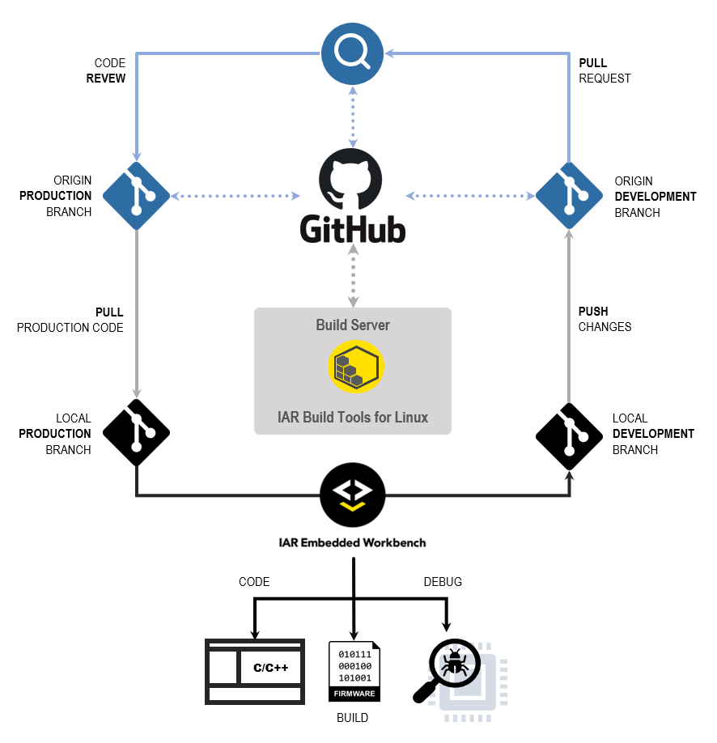
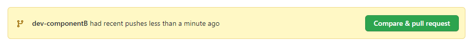
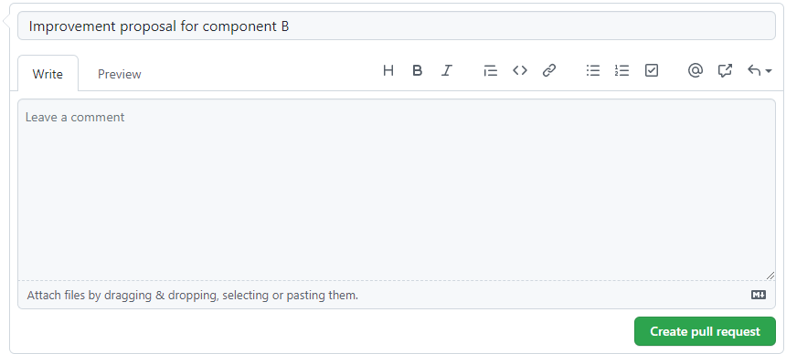

# Tutorial<br/>IAR Build Tools for Linux in a GitHub CI 

Each of the __IAR Build Tools for Linux__ packages requires its specific license. Please feel free to [__contact us__](https://iar.com/about/contact) if you would like to learn how to get access to them.

If you want to be notified in your GitHub inbox about updates to this tutorial, you can start __watching__ this repository. You can customize which types of notification you want to get. Read more about [notifications](https://docs.github.com/en/github/managing-subscriptions-and-notifications-on-github/setting-up-notifications/about-notifications) and how to [customize](https://docs.github.com/en/github/managing-subscriptions-and-notifications-on-github/setting-up-notifications/about-notifications#customizing-notifications-and-subscriptions) them.

If you end up with a question specifically related to [this tutorial](https://github.com/iarsystems/bx-github-ci), you might be interested in verifying if it was already answered from [earlier questions][repo-old-issue-url]. Or, [ask a new question][repo-new-issue-url] if you could not find any answer for your question.


## Introduction
This tutorial provides a simple example with general guidelines on how to set up a CI (Continuous Integration) workflow with [IAR Build Tools for Linux][iar-bx-url] alongside [GitHub](https://github.com).

### GitHub
At GitHub, a private project repository, called __origin__ in the Git jargon, starts with a __master__ branch containing the __production__ code. 

The repository also contains a "recipe" for the workflow under `.github/workflows`. The recipe is written in the __YAML__ format and can be customized. We provided one simple example as base, although the [official documentation][gh-yaml-doc-url] can help with further customizations.

The repository will be configured to use one GitHub's [self-hosted runner][gh-shr-url].

>:warning: GitHub requires an [account][gh-join-url]. An [Azure][gh-azure-url] account also can be used.


### Build server
The __build server__ will be where the [__IAR Build Tools for Linux__][iar-bx-url] are installed.

It will serve as a [self-hosted runner][gh-shr-url] from where the [GitHub's Actions][gh-actions-url] workflow will take place.  This runner will be configured to automatically connect to the __origin__. When triggered, the runner will execute a job that, after cloning the repository and will use the __IAR Build Tools for Linux__ to build these projects.


### Development workstation
On his workstation, a _developer_ clones the repository to start working on a new feature for some project. For that, he creates a __feature branch__.

The _developer_ then launches the [IAR Embedded Workbench][iar-ew-url], from where he can __code__, __build__ and __debug__ the project.

When the _developer_ is done with that, he can, through his own GitHub account, _push_ the branch to the __origin__ using a __git client__.

>:warning: Popular choices for Windows that provide a __git client__ are [Git for Windows][g4w-url], [GitHub for Desktop][gh-gd-url] or even [Ubuntu WSL][wsl-url]. In this tutorial, we are going to use the git from the command-line.

### The typical CI workflow
The objective is to have automated builds for keeping track of which changes break the build before they are introduced into the __master__ branch. This practice can help raise the project's overall quality metrics.

When a _developer_ pushes changes to the __origin__, __GitHub Actions__ comes into play and triggers an action to notify the runner in the __build server__ about the new __push__.

On the build server, the runner will then execute the "recipe" to build the project with the __IAR Build Tools__. 

If the new feature passes, the _code reviewer_ can decide if these changes are ready to be merged to the __master__ branch.

If the new feature fails, the follow-up can be performed within GitHub's facilities for code revision.

This CI repeats as many times as required.



## Conventions
As this tutorial is intended to be flexible with respect to the tools and packages that can be used, it becomes important to establish some conventions for when referring to certain entities.

### Packages
| __Placeholder__ | __Meaning__                                                                               |
| :-------------- | :---------------------------------------------------------------------------------------- |
| `<arch>`        | __Architecture__<br/>Valid: `arm`, `riscv`, `rh850`, `rl78`, `rx`                         |
| `<package>`     | __Product package__<br/>Valid: `arm`, `armfs`, `riscv`, `rh850`, `rh850fs`, `rl78`, `rx`  |
| `<version>`     | __Package version__<br/>Valid: `major`.`minor`.`patch` `[.build]`                         |

Here you will find some examples for different packages and their versions:
| __Package/Version__       | __Replace with__                                                                                                                               |
| :------------------------ | :--------------------------------------------------------------------------------------------------------------------------------------------- |
| BXARM 9.10.1              | IAR Build Tools for Arm version 9.10.1<br/>`<arch>`=`arm`<br/>`<package>`=`arm`<br/>`<version>`=`9.10.1`                                       |
| BXARMFS 8.50.10.35167     | IAR Build Tools for Arm, [Functional Safety Edition](https://www.iar.com/products/requirements/functional-safety/), version 8.50.10<br/>`<arch>`=`arm`<br/>`<package>`=`armfs`<br/>`<version>`=`8.50.10.35167` |
| BXRISCV 1.40.1            | IAR Build Tools for RISC-V version 1.40.1<br/>`<arch>`=`riscv`<br/>`<package>`=`riscv`<br/>`<version>`=`1.40.1`                                |

### Others
| __Placeholder__ | __Meaning__                                                                               |
| :-------------- | :---------------------------------------------------------------------------------------- |
| `<username>`    | Refer to the user's GitHub's account or the user's account in the local machine, according to the context.                    |

## Preparing the repository 
Under GitHub's account, we are going to import the [bx-workspaces-ci][bx-workspaces-url] repository. This is a public repository containing a collection of workspaces which were created using the IAR Embedded Workbench. They can be imported to become a private repository and then used for experimentation with the IAR Build Tools for Linux.

### Importing an example repository
Navigate to
```
https://github.com/new/import
```

Fill __Your old repository's clone URL__ with
```
https://github.com/IARSystems/bx-workspaces-ci
```

On __Your new repository details__, fill with the new name. For this example, let's use `shr-private`:
```
shr-private
```

Make sure that __Privacy__ is set to `private`.

>:warning: GitHub adverts against using self-hosted runners with public repositories due [security reasons][gh-shr-priv-url]. 

Finally, click __Begin import__.

Once the importing process is complete, a message will show up:
>```
>"Your new repository `<username>/shr-private` is ready."
>```
    
Click on the link to the new repository provided in the message to go to the new repository.

### Adding a workflow
On your `shr-private` repository, use the GitHub interface to add the following new file `.github/workflows/bx.yaml`. This workflow contains a single job that runs on a __self-hosted runner__ called "iarbuild" with 3 steps to build the projects in the sequence `library`, `componentA` and `componentB`, after the repository is checked out:
```yaml
name: IAR Build Tools CI
on:
  push:
    branches: [ dev* ]
env:
  BUILD_TYPE: Debug  
  IARBUILD_PATH: /opt/iarsystems/bx<package>-<version>/common/bin
  IARBUILD_OPTS: -log all -parallel 2
jobs:
  iarbuild:
    runs-on: self-hosted
    steps:
      - uses: actions/checkout@v2
      - name: Build Library
        run: $IARBUILD_PATH/iarbuild ./<arch>/library/library.ewp       -build $BUILD_TYPE $IARBUILD_OPTS
      - name: Build Component A
        run: $IARBUILD_PATH/iarbuild ./<arch>/componentA/componentA.ewp -build $BUILD_TYPE $IARBUILD_OPTS
      - name: Build Component B
        run: $IARBUILD_PATH/iarbuild ./<arch>/componentB/componentB.ewp -build $BUILD_TYPE $IARBUILD_OPTS    
```
>:warning: Change `<arch>`, `<package>` and `<version>` to match with the __IAR Build Tools for Linux__ you are using. Please refer to [Conventions](#conventions) for details.

### Adding a runner to the repository
The GitHub repository must be set to use a __runner__.

Go to __Settings/Actions/Runners/New__:
```
https://github.com/<username>/shr-private/settings/actions/runner/new
```

For __Operating System__: select __`Linux`__.

For __Architecture__: select __`x64`__.

Leave this page open.
    
## Setup the Build Server
Go to the __build server__ and perform the following setup.

### Setup the runner
Use the GitHub's provided instructions for __Download__ and __Configure__ the self-hosted runner, using its default configurations.

>:warning: By downloading and configuring the GitHub Actions Runner, you agree to the [GitHub Terms of Service](https://docs.github.com/github/site-policy/github-terms-of-service) or [GitHub Corporate Terms of Service](https://docs.github.com/github/site-policy/github-corporate-terms-of-service), as applicable.

Once the runner is in place, go to the repository's __Settings/Actions__ page at:
```
https://github.com/<username>/shr-private/settings/actions
```

The status for the __Self-hosted runner__ should be `Idle` at this point:


### Install the IAR Build Tools for Linux
Install the IAR Build Tools for Linux.

>:warning: Follow the instructions and recommendations of the User Guide that comes with the product.

Additionally, it is possible to add the __IAR Build Tools__ directories containing the executables to the search `PATH`, so they can be executed from anywhere without entering with their full path. This is not a requirement for this tutorial, but it might be convenient for some users.
    
For example, paste the snippet below to the user's `$HOME/.profile` (or else the `$HOME/.bashrc`) file:
```sh
if [ -d "/opt/iarsystems/bx<package>-<version>" ]; then
  PATH="/opt/iarsystems/bx<package>-<version>/<arch>/bin:/opt/iarsystems/bx<package>-<version>/common/bin:$PATH"
fi
```

>:warning: Change `<arch>`, `<package>` and `<version>` to match with the __IAR Build Tools for Linux__ you are using. Please refer to [Conventions](#conventions) for details.

After the file is saved, it is possible to source the file you modified so the changes take effect immediately. For example, 
```
source ~/.profile
```


## Developing a Project
Now that the server-side of the setup is done, let's start to try it from a __developer__'s perspective, from within the [Development workstation](#development-workstation).


### Cloning the repository    
Launch the terminal which provides your __git client__ and clone the `shr-private` repository you imported into your `<username>` account:

```
git clone https://github.com/<username>/shr-private.git /mnt/c/shr-private && cd /mnt/c/shr-private
```
>:warning: For this tutorial we are assuming that the clone location will be the `C:\shr-private` folder.

    
### Switching to a feature branch        
Now let's consider starting to work on a new feature for the `ComponentB`. Checkout a new branch named "dev-componentB", derived from the master branch:
```
git checkout -b dev-componentB master
```

In the __IAR Embedded Workbench IDE__ choose `File` → `Open Workspace...` and navigate to `C:\shr-project\<arch>`. You will find a `workspace.eww` file. Go ahead and __open__ it.

This example workspace comes with 3 projects:
* library
* componentA
* componentB

Right-click on the __`library`__ project and choose `Make` (or <kbd>F7</kbd>). The `library` project should be built with no errors.

Now right-click on the `componentB` project and __Set as Active__.

Unfold the __`componentB`__ project tree and double click on its [main.c](../workspace/portable/componentB/main.c) file so it will open in the __Code Editor__.

Right-click on __`componentB`__ and choose `Make` (or <kbd>F7</kbd>). The `componentB` project should be built with no errors.


### Changing the code for the `componentB` project 
The __developer__ starts to work on the `dev-componentB` branch and, for illustrative purposes, the `DATATYPE` used in `componentB` had to change from `uint16_t` to __`float`__, for example, to hold values greater than `0xFFFF`.

On the [main.c](../workspace/portable/componentB/main.c) file, right-click on the line with the __[`#include "library.h"`](../workspace/portable/componentB/main.c#L12)__ and choose __Open "library.h"__.

In the [library.h](../workspace/portable/library/library.h) file, find the line __[`#define DATATYPE uint16_t`](../workspace/portable/library/library.h#L19)__ and replace it with
```c
#define DATATYPE float
```
  
In the [main.c](../workspace/portable/componentB/main.c) file, update the constant `z` to `100000`.
```c
  const DATATYPE z = 100000;
```

On the same file, update the `debug_log()` function string format to handle the __float__ type. Change the formatted string from `%d` to `%f` as below:
```c
  debug_log("Sum = %f\r\n", sum);
```
and
```c
  debug_log("Mul = %f\r\n", mul);
```
  
Rebuild the `library` project using right-click on `library` and choose `Make` (or <kbd>F7</kbd>). It should build with no errors.

Rebuild the `componentB` project using right-click on `componentB` and choose `Make` (or <kbd>F7</kbd>). It should build with no errors.

>:warning: If you want, you can debug the project using `Project` → `Download & Debug` (or <kbd>CTRL</kbd>+<kbd>D</kbd>). The details of debugging a project are not going to be covered in this tutorial. For further details on debugging a project, refer to the `Help` → `C-SPY Debugging Guide` document that is shipped with the product.


### Commit the changes
Go back to the terminal where you used your __git client__. 

Commit to the changes to the tracked files in the cloned `shr-project` repository:
```
git commit --all --message "Improvement proposal for componentB"
```

The expected output is similar to this, but with a different commit hash:
>```
>[dev-componentB 5b03ed8] Improvement proposal for componentB
>  2 files changed, 5 insertions(+), 5 deletions(-)
>```

Finally publish these changes with `git push`, so the code changes go back to the __origin__ repository:
```
git push --set-upstream origin dev-componentB
```

## Creating a Pull Request
Then it is time for the __developer__ to go back his __GitHub.com__:

Go to `https://github.com/<username>/shr-private` and notice that there is a new yellow banner on the top


Click `Compare & pull request`.

Here, GitHub will give you the opportunity to write an explanation of the new feature you are pushing for the `componentB` project. That way, the code reviewer can have a better picture of what is going on.



Once ready, click `Create pull request`.

>:warning: Follow the link to learn more [about pull requests](https://docs.github.com/en/free-pro-team@latest/github/collaborating-with-issues-and-pull-requests/about-pull-requests).
    
    
## Reviewing the Pull Request
The [bx-workspaces-ci][bx-workspaces-url] repository comes pre-loaded with a [workflow][gh-actions-url] configured in the [`.github/workflows/bx.yml`](#adding-a-workflow) file that will trigger the notification the runner in the __build server__ needs to build all the 3 projects automatically when a new feature branch goes through a pull request.
    
Now a project's code reviewer can start [reviewing the pull request](https://docs.github.com/en/free-pro-team@latest/github/collaborating-with-issues-and-pull-requests/approving-a-pull-request-with-required-reviews) containing the proposed changes in the new feature.

With the right workflow for a project, if some developer created something new that breaks the existing build, it will fail the automated verification. So a code reviewer can know immediately about the breakage and its details.


In this case, the author's proposed change to the shared `library` worked nicely for `componentB` but it didn't for `componentA`. 
    
The code reviewer can contact the author using `pull request` page, so it is easy to keep track of any amends to the proposed code, until it is approved or rejected.


## Summary

In short, in this tutorial we went through one of the many ways that the [IAR Build Tools for Linux][iar-bx-url] can be used in CI scenarios.

Over time, a practice like this can help guaranteeing convergence to improved quality of the production grade code base. It also helps avoiding that new features break other parts of a project. Ultimately it builds a development log of the project which, when properly used, can become a solid asset for consistent deliveries as the project evolves.    
    
The IAR Build Tools for Linux along with the GitHub CI provides a great and scalable way to manage automation tasks for building, and analyzing embedded software projects. Hence it might be suitable for many use cases.
   
For more tutorials like this, stay tuned on our [GitHub page][gh-iar-url].

<!-- links -->
[iar-bx-url]: https://www.iar.com/bx
[iar-ew-url]: https://www.iar.com/products/architectures
[iar-lms2-url]: https://links.iar.com/lms2-server
[iar-bkpt-url]: https://www.iar.com/about/news-and-events/the-weekly-breakpoint-blog

[gh-join-url]: https://github.com/join
[gh-azure-url]: https://azure.microsoft.com/en-us/products/github
[gh-yaml-doc-url]: https://docs.github.com/en/free-pro-team@latest/actions/reference/workflow-syntax-for-github-actions
[gh-shr-url]: https://docs.github.com/en/free-pro-team@latest/actions/hosting-your-own-runners/about-self-hosted-runners 
[gh-shr-priv-url]: https://docs.github.com/en/free-pro-team@latest/actions/hosting-your-own-runners/about-self-hosted-runners#self-hosted-runner-security-with-public-repositories
[gh-actions-url]: https://docs.github.com/en/actions
[gh-gd-url]: https://desktop.github.com/
[gh-iar-url]: https://github.com/IARSystems
    
[g4w-url]: https://git-scm.com/download/win
[wsl-url]: https://www.microsoft.com/en-us/p/ubuntu-2004-lts/9n6svws3rx71

[bx-workspaces-url]: https://github.com/IARSystems/bx-workspaces-ci
[repo-wiki-url]: https://github.com/IARSystems/bx-github-ci
[repo-new-issue-url]: https://github.com/IARSystems/bx-github-ci/issues/new
[repo-old-issue-url]: https://github.com/IARSystems/bx-github-ci/issues?q=is%3Aissue+is%3Aopen%7Cclosed
