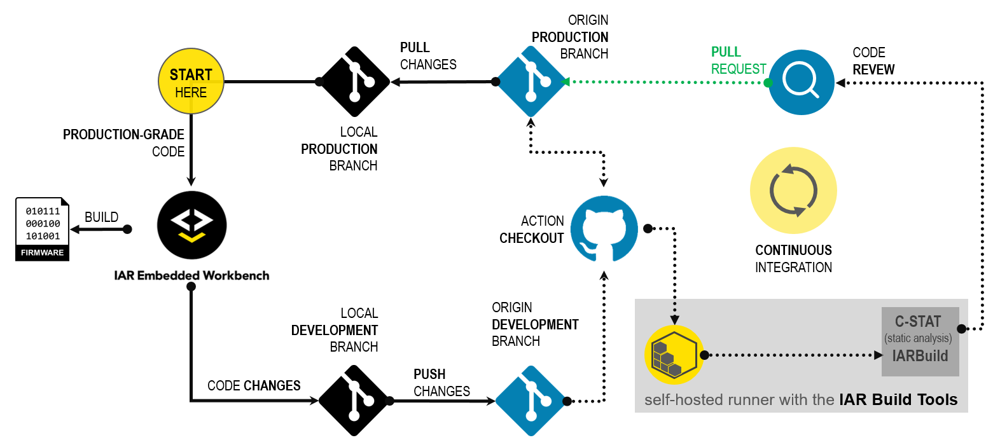
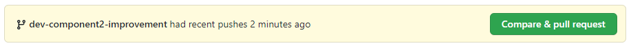
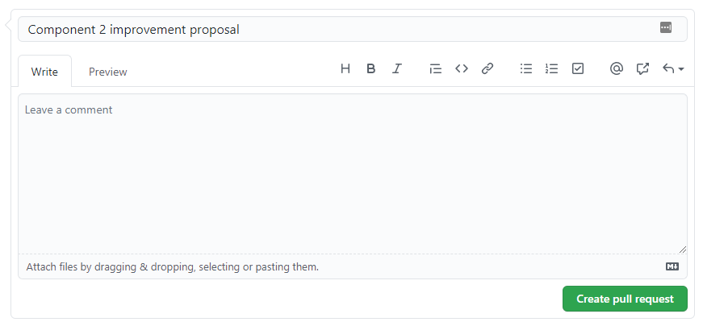
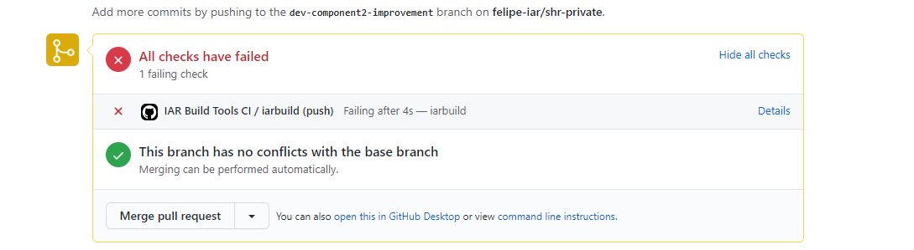

# Tutorial<br/>IAR Build Tools for Linux in a GitHub CI 


This tutorial provides a simple example with general guidelines on how to setup a CI (Continuous Integration) workflow with [IAR Build Tools for Linux][iar-bx-url] alongside [GitHub](https://github.com).

Each of the __IAR Build Tools__ packages requires its specific license. Please feel free to [__contact us__](https://iar.com/about/contact) if you would like to learn how to get access to them.

If you want to be notified in your GitHub inbox about updates to this tutorial, you can start __watching__ this repository. You can customize which types of notification you want to get. Read more about [notifications](https://docs.github.com/en/github/managing-subscriptions-and-notifications-on-github/setting-up-notifications/about-notifications) and how to [customize](https://docs.github.com/en/github/managing-subscriptions-and-notifications-on-github/setting-up-notifications/about-notifications#customizing-notifications-and-subscriptions) them.

If you end up with a question specifically related to [this tutorial](https://github.com/iarsystems/bx-github-ci), you might be interested in verifying if it was already answered from [earlier questions][repo-old-issue-url]. Or, [ask a new question][repo-new-issue-url] if you could not find any answer for your question.


## Introduction
### GitHub
At GitHub, a private project repository, called __origin__ in the Git jargon, starts with a __master__ branch containing the project's __production code__ base. 

The repository also contains a "recipe" for the workflow under `.github/workflows`. The recipe is written in the __YAML__ format and can be customized. We provided simple examples as base, although the [official documentation][gh-yml-doc-url] can help with further customizations.

The repository will be configured to use a GitHub's [self-hosted-runner][gh-shr-url].

>:warning: GitHub requires an [account][gh-join-url]. An [Azure][gh-azure-url] account also can be used.


### Build server
The __build server__ will contain the [__IAR Build Tools for Linux__][iar-bx-url] installed.

It will also use the [GitHub's Actions][gh-actions-url] workflow relying on its [self-hosted runners][gh-shr-url] feature.  This runner will be configured to automatically connect directly to a corresponding GitHub [__private__][gh-shr-priv-url] repository containing one or more software projects, clone the repository and then use the __IAR Build Tools for Linux__ to build and analyze these projects.


### Development workstation
On his workstation, a _developer_ clones the repository to start working on a new feature. For that, he creates a __feature branch__.

The _developer_ launches the [IAR Embedded Workbench][iar-ew-url], from where he can edit, build and debug the project.

When the _developer_ is done with that, he can _push_ the branch to the __origin__ using his __git client__.

>:warning: Popular choices for Windows that provide a __git client__ are [Git for Windows][g4w-url] or [Ubuntu WSL][wsl-url].

### The typical CI workflow
The objective is to have automated builds for raising the project's overall quality matrics.

When a _developer_ pushes changes to the __origin__, __GitHub Actions__ come into play and triggers an action to notify the runner in the _build server_ about the new _push_.

On the build server, the runner will then execute the "recipe" to build the project with the __IAR Build Tools__. 

If the new feature passes, the _project manager_ can decide if these changes are ready to be merged to the __master__ branch.

If the new feature fails, the follow-up can be performed within GitHub's facilities for code revision.

This CI repeats as many times as required.



## Conventions
As this tutorial is intended to be flexible with respect to the tools and packages that can be used, it becomes important to establish some conventions for when referring to certain entities.

### Packages
| __Placeholder__ | __Meaning__                                                                               |
| :-------------- | :---------------------------------------------------------------------------------------- |
| `<arch>`        | __Architecture__<br/>Valid: `arm`, `riscv`, `rh850`, `rl78`, `rx`                         |
| `<package>`     | __Product package__<br/>Valid: `arm`, `armfs`, `riscv`, `rh850`, `rh850fs`, `rl78`, `rx`  |
| `<version>`     | __Package version__<br/>Valid: `major`.`minor`.`patch` `[.build]`                         |

Here you will find some examples for different packages and their versions:
| __Package/Version__       | __Replace with__                                                                                                                               |
| :------------------------ | :--------------------------------------------------------------------------------------------------------------------------------------------- |
| BXARM 9.10.1              | IAR Build Tools for Arm version 9.10.1<br/>`<arch>`=`arm`<br/>`<package>`=`arm`<br/>`<version>`=`9.10.1`                                       |
| BXARMFS 8.50.10.35167     | IAR Build Tools for Arm, [Functional Safety Edition](https://www.iar.com/products/requirements/functional-safety/), version 8.50.10<br/>`<arch>`=`arm`<br/>`<package>`=`armfs`<br/>`<version>`=`8.50.10.35167` |
| BXRISCV 1.40.1            | IAR Build Tools for RISC-V version 1.40.1<br/>`<arch>`=`riscv`<br/>`<package>`=`riscv`<br/>`<version>`=`1.40.1`                                |

## Preparing the repository 
Under the GitHub's account, we are going to import the [bx-workspaces-ci][bx-workspaces-url] repository. This is a public repository containing a collection of workspaces created with the IAR Embedded Workbench. They can be imported to become a private repository and then used for experimentation.

Navigate to
```
https://github.com/new/import
```

Fill __Your old repository's clone URL__ with
```
https://github.com/IARSystems/bx-workspaces-ci
```

On __Your new repository details__, fill with the new name. For this example, let's use `shr-private`:
```
shr-private
```

Make sure that __Privacy__ is set to `private`.

>:warning: GitHub adverts against using self-hosted runners on public repositories due [security issues][gh-shr-priv-url] when using self-hosted runners on public repositories. 

Finally, click __Begin import__.

Once the importing process is complete, a message will show up:
>```
>"Your new repository '<username>/shr-private' is ready."
>```
    
Click on the link to the new repository provided in the message. 
    
Go to __Settings/Actions/Add Runner__:
```
https://github.com/<username>/shr-private/settings/actions/add-new-runner 
```

For __Operating System__: select __`Linux`__.

For __Architecture__: select __`x64`__.

Leave this page open.
    
## Setup the Build Server
Go to the __build server__ and perform the following setup.

### Setup the runner
Use the GitHub's provided instructions for...

* __Download__ and __Configure__

the self-hosted runner, using its default configurations.

>:warning: It is possible to move the mouse pointer to each desired line. In the sequence and click on the __clipboard icon__ to copy the line's contents to the clipboard. Then paste it to the __Build Server__'s terminal.

    
Once the runner is in place, go to the repository's __Settings/Actions__ page at:
```
https://github.com/<username>/shr-private/settings/actions
```

The status for the __Self-hosted runner__ should be `Idle` at this point:


### Install the IAR Build Tools for Linux
Install the IAR Build Tools for Linux.

>:warning: Follow the instructions and recommendations of the User Guide that comes with the product.

Additionally, it is possible to add the __IAR Build Tools__ directories containing the executables to the search `PATH`, so they can be executed from anywhere.
For example, paste the snippet below to the user's `$HOME/.profile` (or else the `$HOME/.bashrc`) file:
```sh
if [ -d "/opt/iarsystems/bx<arch>" ]; then
  PATH="/opt/iarsystems/bx<arch>/<arch>/bin:/opt/iarsystems/bx<arch>/common/bin:$PATH"
fi
```

Then update the `bx<arch>` in all the paths so they match the product you are using and save the file.

Source the file you modified for the changes to take effect:
For example, 
```
source ~/.profile
```


## Developing a Project
Now that the server-side of the setup is done, let's start to try it from a __developer__'s perspective, from within the [Development workstation](#development-workstation).
    
    
### Cloning the repository    
Launch the terminal which provides your __git client__ and clone the `shr-private` repository you imported into your `<username>` account:

```
git clone https://github.com/<username>/shr-private.git /mnt/c/shr-private && cd /mnt/c/shr-private
```
>:warning: For this tutorial we are assuming that the clone location will be the `C:\shr-private` folder.

    
### Switching to the `dev-componentB` feature branch        
    
Now let's consider starting to work on a new feature for the `ComponentB`. Checkout a new branch named "dev-componentB"
```
git checkout -b dev-componentB
```

Choose `File` > `Open Workspace...` and navigate to `C:\shr-project\<arch>`. You will find a `workspace.eww` file. Go ahead and __open__ it.

This example workspace comes with three projects:
* library
* componentA
* componentB

Right-click on the __`library`__ project and choose `Make` (or <kbd>F7</kbd>). The `library` project should be built with no errors.
   - Now right-click on the `componentB` project and __Set as Active__.
   - Unfold the __`componentB`__ project tree and double click on its [main.c](../workspace/portable/componentB/main.c) file so it will open in the __Code Editor__.
   - Right-click on __`componentB`__ and choose `Make` (or <kbd>F7</kbd>). The `componentB` project should be built with no errors.

### Changing the code for `componentB` project 

The __developer__ starts to work on the `dev-componentB` branch and, for illustrative purposes, the `DATATYPE` used in `componentB` had to change from `uint16_t` to __`float`__, for example, to hold values greater than `0xFFFF`.

On the [main.c](../workspace/portable/componentB/main.c) file, right-click on the line with the __[`#include "library.h"`](../workspace/portable/componentB/main.c#L12)__ and choose __Open "library.h"__.

In the [library.h](../workspace/portable/library/library.h) file, find the line __[`#define DATATYPE uint16_t`](../workspace/portable/library/library.h#L19)__ and replace it with
```c
#define DATATYPE float
```
  
In the [main.c](../workspace/portable/componentB/main.c) file, update the constant `z` to `100000`.
```c
  const DATATYPE z = 100000;
```

On the same file, update the `debug_log()` function string format to handle the __float__ type. Change the formatted string from `%d` to `%f` as below:
```c
  debug_log("Sum = %f\r\n", sum);
```
and
```c
  debug_log("Mul = %f\r\n", mul);
```
  
Rebuild the `library` project using right-click on `library` and choose `Make` (or <kbd>F7</kbd>). It should build with no errors.

Rebuild the `componentB` project using right-click on `componentB` and choose `Make` (or <kbd>F7</kbd>). It should build with no errors.

### Commit the changes
Go back to the Git bash terminal.

Commit to the changes to the tracked files in the cloned `shr-project` repository:
```
git commit --all --message "Improvement proposal for componentB"
```

The expected output is similar to this, but with a different commit hash:
>```
>[dev-componentB 5b03ed8] Improvement proposal for componentB
>  2 files changed, 5 insertions(+), 5 deletions(-)
>```

Finally publish these changes with `git push`, so the code changes go back to the `origin` repository:
```
git push --set-upstream origin dev-componentB
```

Push output example:
>```
>Enter passphrase for key '/home/<developer>/.ssh/id_ed25519_dev':
>Enumerating objects: 9, done.
>Counting objects: 100% (9/9), done.
>Delta compression using up to 8 threads
>Compressing objects: 100% (6/6), done.
>Writing objects: 100% (7/7), 578 bytes | 430.00 KiB/s, done.
>Total 7 (delta 4), reused 0 (delta 0)
>To git@github.com:<username>/shr-project.git
> * [new branch]      dev-componentB -> dev-componentB
>Branch 'dev-componentB' set up to track remote branch 'dev-componentB' from 'origin'.
>```
   
## Creating a Pull Request
Then it is time for the __Developer__ to go back to __GitHub.com__:

* Go to `https://github.com/<username>/shr-private` and notice that there is a new yellow bar saying that


* Click `Compare & pull request`

* Here, GitHub will give the __Developer__ the opportunity to write the rationale for the `component2` improvement proposal so the __Project Manager__ can have a better picture of what is going on


* Once ready, click `Create pull request`

> __Tip__
> * Follow the link to learn more [About pull requests](https://docs.github.com/en/free-pro-team@latest/github/collaborating-with-issues-and-pull-requests/about-pull-requests)

> __Note__
> * This repository comes prepared with a __GitHub Action [workflow](https://docs.github.com/en/free-pro-team@latest/actions/reference/workflow-syntax-for-github-actions)__ configurated in the [bxarm.yml](.github/workflows/bxarm.yml) file to build all the 3 projects.
    
## Reviewing the Pull Request
It is time for the __Project Manager__ to start [reviewing the pull request](https://docs.github.com/en/free-pro-team@latest/github/collaborating-with-issues-and-pull-requests/approving-a-pull-request-with-required-reviews) which was proposed by the __Developer__ containing the new feature.

Our basic GitHub Actions workflow file bxarm.yml will trigger every time a new feature branch goes through a pull request.

Once it is triggered, it will use the __IAR Build Tools__ installed in the __Build Server__ alongside the runner deamon listening for new jobs.

If a __Developer__ created something new that breaks the build, it will fail the automated verification, warn the __Project Manager__ about the breakage and detail the root cause of the failure.


In this case, the author's proposed change to the shared `library` worked nicely for the `component2` but it has broken the `component1` build.

The __Project Manager__ can now contact the author using the `pull request` itself to keep track of any changes, propose alternatives or even fix other components of the project which might had lurking bugs and which no one else noticed for a while.

Over time this practice helps guaranteeing convergence to improved quality of the `production`-grade code base. It also helps avoiding that new features break other parts of a project. Ultimately it builds a development log of the project which, when properly used, can become a solid asset for consistent deliveries as the project evolves.


## Summary
In short, in this tutorial we went through one of the many ways that the [IAR Build Tools for Linux][iar-bx-url] can be used in CI scenarios.
   
The GitHub Actions provides a great and scalable way to manage automation tasks for building, testing and deploying software. 
   
For more tutorials like this, stay tuned on our [GitHub page][gh-iar-url] and the [IAR Build Tools official page][iar-bx-url] and the [Weekly Breakpoint blog][iar-bkpt-url].

<!-- links -->
[iar-bx-url]: https://www.iar.com/bx
[iar-ew-url]: https://www.iar.com/products/architectures
[iar-lms2-url]: https://links.iar.com/lms2-server
[iar-bkpt-url]: https://www.iar.com/about/news-and-events/the-weekly-breakpoint-blog

[gh-join-url]: https://github.com/join
[gh-azure-url]: https://azure.microsoft.com/en-us/products/github
[gh-yml-doc-url]: https://docs.github.com/en/free-pro-team@latest/actions/reference/workflow-syntax-for-github-actions
[gh-shr-url]: https://docs.github.com/en/free-pro-team@latest/actions/hosting-your-own-runners/about-self-hosted-runners 
[gh-shr-priv-url]: https://docs.github.com/en/free-pro-team@latest/actions/hosting-your-own-runners/about-self-hosted-runners#self-hosted-runner-security-with-public-repositories
[gh-actions-url]: https://docs.github.com/en/actions
[gh-iar-url]: https://github.com/IARSystems
    
[g4w-url]: https://git-scm.com/download/win
[wsl-url]: https://www.microsoft.com/en-us/p/ubuntu-2004-lts/9n6svws3rx71

[bx-workspaces-url]: https://github.com/IARSystems/bx-workspaces-ci
[repo-wiki-url]: https://github.com/IARSystems/bx-github-ci
[repo-new-issue-url]: https://github.com/IARSystems/bx-github-ci/issues/new
[repo-old-issue-url]: https://github.com/IARSystems/bx-github-ci/issues?q=is%3Aissue+is%3Aopen%7Cclosed
